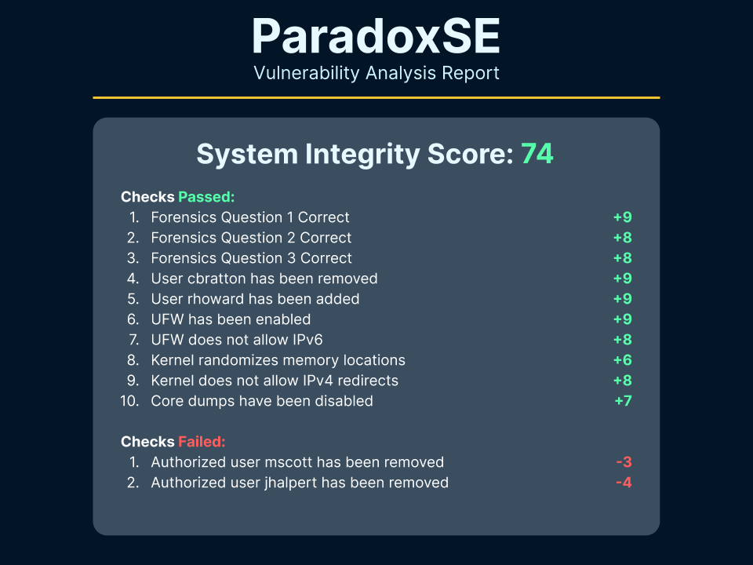

# ParadoxSE

🔒 Live security competition scoring engine for `apt`-based systems

## 💡 Features

-   Easy-to-use YAML configuration
-   Extensive documentation
-   Lightweight & easily readable
-   Elegant and organized
-   Uses Python to directly interact directly with system rather that running OS commands (mostly)

## ✨ In Action



## 💻 Try it out

```sh
bash <(curl -s https://raw.githubusercontent.com/safinsingh/ParadoxSE/master/install.sh)
```

## 🔮 Usage

All configuration must be added in `config.yml`. View the different functions options at the [documentation](https://safinsingh.tech/ParadoxSE) or view the [sample](https://github.com/safinsingh/ParadoxSE/blob/master/config.yml) `config.yml`.

> NOTE: To build for production, specify `ParadoxSE(production=True)` in the `worker.py` file. Then, run `pip3 install pyinstaller && pyinstaller engine.py` to compile the engine with your configuration into a secure binary.

## 👨‍💻 Author

**Safin Singh**

## 🤝 Contributing

Contributions, PRs, issues and feature requests are welcome! Feel free to check out our [issues page](https://github.com/safinsingh/ParadoxSE/issues).

## ❤️ Show your support

Give a ⭐️ if this project helped you!
Hope you enjoy it!
